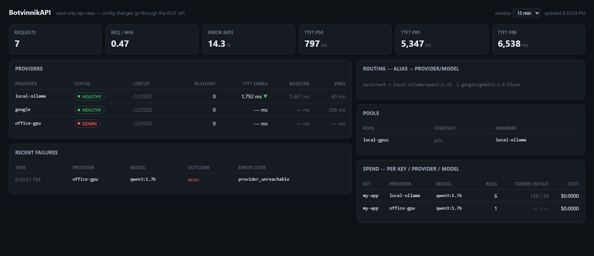
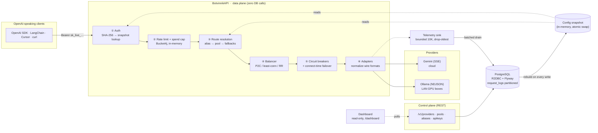

<div align="center">
  

  <h3>A JVM-native LLM gateway. Your clients speak OpenAI — your providers don't have to.</h3>

  <p>
    
    
    
    
    
    
  </p>
</div>

---

**BotvinnikAPI** sits between anything that speaks the OpenAI wire protocol and your actual LLM backends — a GPU box running **Ollama** in the next room, **Google Gemini** in the cloud, or both at once. Clients call one endpoint with one API key; the gateway handles routing, load balancing, failover, streaming, rate limits, and spend tracking. Point the official OpenAI SDK, LangChain, LlamaIndex, Cursor, or Continue.dev at it and they work **unmodified**:

```python
client = OpenAI(base_url="http://localhost:4000/v1", api_key="sk_live_...")

client.chat.completions.create(
    model="assistant",          # an alias — retarget it server-side, zero client changes
    messages=[...],
    stream=True,
)
```

That `model="assistant"` is the core trick: it's an **alias** the operator maps to `office-gpu/qwen3:4b` with a fallback chain to `google/gemini-2.5-flash`. Migrate every client from a local model to a cloud one (or back) with a single `PATCH` — no code changes, no redeploys.

> **Protocol vs. providers:** OpenAI is the *client-facing protocol* — the de-facto standard every AI tool already speaks. Behind it, the gateway talks to each provider in its **native** wire format. Two provider families are supported today, **Ollama** (NDJSON streaming) and **Gemini** (SSE), and the adapter interface makes each additional one a single class — an OpenAI-compatible adapter would also unlock Groq, OpenRouter, vLLM, and every other API that clones that wire format.

## What it does

| | |
|---|---|
| 🔌 **OpenAI-compatible data plane** | `/v1/chat/completions` (streaming + non-streaming) and `/v1/models`, with tool calls, `reasoning_content`, and SSE framing that terminates in `[DONE]` |
| 🔀 **Native provider adapters** | Ollama (NDJSON) and Gemini (SSE) — each speaks its provider's real wire format, and chunk shapes are normalized into one universal stream |
| 🏊 **Pools + load balancing** | P2C (power-of-two-choices), least-connections, or round-robin across identical backends, keyed on **live in-flight depth**, not request counts |
| 💔 **Circuit breakers + failover** | Connect-time failures walk the alias fallback chain; a dead provider is short-circuited after 4 failures and probed back to life automatically |
| 📈 **TTFT-based health** | Providers are `HEALTHY / DEGRADED / OPEN / DOWN` from a dual-rate moving average of time-to-first-token — degradation is detected *before* hard failure |
| 🔐 **Auth + hardening** | SHA-256-hashed gateway keys (shown once), Bucket4j rate limits, USD spend caps, AES-GCM-encrypted provider credentials, DNS-rebinding-proof SSRF guard |
| 📊 **Telemetry + dashboard** | Request logs with cost attribution in partitioned Postgres, `/v1/usage`, `/v1/stats` percentiles, and a zero-dependency read-only dashboard at `/dashboard` |

## The ops view

Everything the gateway knows, on one read-only page at `/dashboard` — provider health with TTFT trends, circuit states, traffic percentiles, the live routing table, spend attribution, and recent failures:

<div align="center">
  
</div>

Here `office-gpu` (a LAN machine that's offline) is flagged **DOWN** while traffic keeps flowing through `local-ollama`; the `assistant` alias routes to a local Qwen model with a Gemini fallback; and every request is attributed to the API key that made it.

## Architecture



**The load-bearing rule:** the data plane never makes a synchronous database call. Every request is served from an in-memory config snapshot that is atomically rebuilt on each control-plane write. The hot path costs one SHA-256, a few map lookups, and one JSON transform — the database exists for the operator, not the request.

## Design decisions that matter

- **Point of no return.** Once `200 OK` and the first chunk are flushed, the gateway *cannot* fail over — HTTP can't un-send bytes. Mid-stream provider death emits a structured error chunk then `[DONE]`; failover happens only at connect time, where it's free. This boundary is enforced in code and proven by tests that assert the backup receives **zero** wire calls.
- **Round-robin is wrong for LLMs.** Requests run 200ms–3min depending on output length, so request *count* ≠ request *cost*. Balancing keys off live in-flight depth; P2C avoids the thundering-herd on "least loaded".
- **A refusal is not a failure.** Safety-filter blocks and model refusals pass through as `200` — treating them as errors would burn the fallback chain and return `503` for a request that succeeded. Circuit breakers count only availability-class failures (5xx, 429, unreachable, stream-idle-timeout).
- **Idle timeout, not total timeout.** A legitimate generation can take three minutes; the pathology is *silence between chunks*. Timeouts sit on the inter-chunk gap.
- **Cancellation propagates.** A client disconnect cancels the reactive chain and closes the upstream connection — you stop paying for tokens nobody reads. Explicitly tested, because one stray operator silently breaks it.
- **SSRF defense at connect time.** Operators register arbitrary URLs, so the resolver validates the IP **at the moment of connection** — a parse-time check can be defeated by DNS rebinding. Metadata/link-local/CGNAT ranges are blocked; redirects are disabled; RFC1918 is allowlisted by config because routing to LAN GPUs is the whole point.
- **Credentials done by the book.** Gateway keys: SHA-256, shown once, never stored (256 bits of entropy — there is nothing for bcrypt to slow down). Provider keys: AES-GCM-256 at rest with a fresh nonce per record, key from env.

## Measured performance

Benchmarked with full auth enabled against a near-zero-latency stub provider, so the numbers isolate the gateway itself (dev laptop, load generator sharing the CPU — treat as conservative):

| Load | Throughput | p50 | p95 | p99 | Errors |
|---|---|---|---|---|---|
| 10 concurrent | 6,700 req/s | 1.3 ms | 2.8 ms | 4.1 ms | 0 |
| 50 concurrent | 9,700 req/s | 4.2 ms | 10.8 ms | 18.8 ms | 0 |
| 200 concurrent | **~10,500 req/s** | 14.6 ms | 43.2 ms | 99.4 ms | 0 |

- **Added latency at p50: ~0.3 ms** over a direct call — against a real LLM's 200–3,000 ms, the gateway disappears.
- **Zero errors** at every concurrency level, including 200-way.
- Telemetry is a **bounded 10K queue with drop-oldest** and a batched ~500 rows/s drain — a slow database degrades logging, never requests.
- Streaming memory is O(chunk): chunks pass through, nothing accumulates; backpressure to a slow client is TCP flow control, for free.

## Quickstart

Prereqs: **JDK 25**, **Docker** (for Postgres), and optionally [Ollama](https://ollama.com) with a model pulled.

```bash
# 1. Postgres
docker run -d --name botvinnik-pg \
  -e POSTGRES_USER=botvinnik -e POSTGRES_PASSWORD=botvinnik -e POSTGRES_DB=botvinnik \
  -p 5432:5432 postgres:17-alpine

# 2. Environment (GEMINI_API_KEY is required at boot; use any placeholder if you only run local models)
export GEMINI_API_KEY=your-gemini-key
export GATEWAY_ENCRYPTION_KEY=$(openssl rand -base64 32)   # recommended; dev fallback otherwise

# 3. Run — Flyway migrates the schema, providers from application.yaml are seeded
./mvnw spring-boot:run

# 4. Mint an API key (shown once — save it)
curl -X POST localhost:4000/v1/apikeys -H 'Content-Type: application/json' \
  -d '{"name":"my-app","rate_limit_rpm":120}'

# 5. Chat through it
curl localhost:4000/v1/chat/completions \
  -H "Authorization: Bearer sk_live_..." -H 'Content-Type: application/json' \
  -d '{"model":"local-ollama/qwen3:1.7b","messages":[{"role":"user","content":"hello"}]}'
```

Then wire up an alias with a fallback chain and stop hardcoding models in clients:

```bash
curl -X POST localhost:4000/v1/aliases -H 'Content-Type: application/json' \
  -d '{"alias":"assistant","primary":"local-ollama/qwen3:1.7b","fallbacks":["google/gemini-2.5-flash"]}'
```

Dashboard: open **http://localhost:4000/dashboard** — provider health with TTFT trends, circuit states, traffic percentiles, spend per key, recent failures, and the live routing table.

## API surface

**Data plane** (OpenAI-compatible, requires `Authorization: Bearer sk_live_…`):

```
POST /v1/chat/completions        stream: true | false
GET  /v1/models                  union of models across providers
```

**Control plane** (operator, localhost/trusted network):

```
POST/GET/PATCH/DELETE  /v1/providers      register local or cloud backends
POST/GET               /v1/pools          group providers for load balancing
POST/GET/PATCH/DELETE  /v1/aliases        alias → model → provider + fallbacks
POST/GET/DELETE        /v1/apikeys        keys with rate limits, spend caps, token caps
GET                    /v1/health         status, circuit, in-flight, TTFT per provider
GET                    /v1/logs           request history, filterable
GET                    /v1/usage          token spend per key / provider / model
GET                    /v1/stats          req/min, error rate, TTFT p50/p95/p99
```

## Failure semantics at a glance

| Failure | Behavior |
|---|---|
| Provider unreachable at connect | Circuit opens → failover down the chain → `503` if exhausted |
| Provider dies mid-stream | Structured error chunk + `[DONE]` — never a silent hang, never a retracted stream |
| Client disconnects mid-stream | Upstream connection closed; token spend stops |
| Provider hangs (3 tok/min) | Idle timeout between chunks (`504 stream_idle_timeout`) |
| Upstream `429` / `5xx` | Counted by the breaker, failover-eligible |
| Model refuses / safety filter | `200 OK`, passed through verbatim — **not a failure** |
| Rate limit / spend cap hit | `429` at ingress with `Retry-After`, before any routing work |

## Testing

93 tests, biased heavily toward failure injection: WireMock providers that return `500`s and garbage, raw Netty servers that die mid-body or hang forever, cancellation-propagation asserts backed by connection-disposal latches, circuit-breaker trip counts verified at the wire level, and full control-plane contract tests against real Postgres via Testcontainers.

```bash
./mvnw test
```

## Scope

Single-operator deployment by design: no multi-tenancy, no RBAC, no moderation engine, no semantic caching. It routes; it does not infer. Keep the control plane on localhost or a trusted network — it is intentionally unauthenticated.
