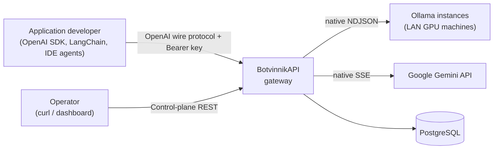
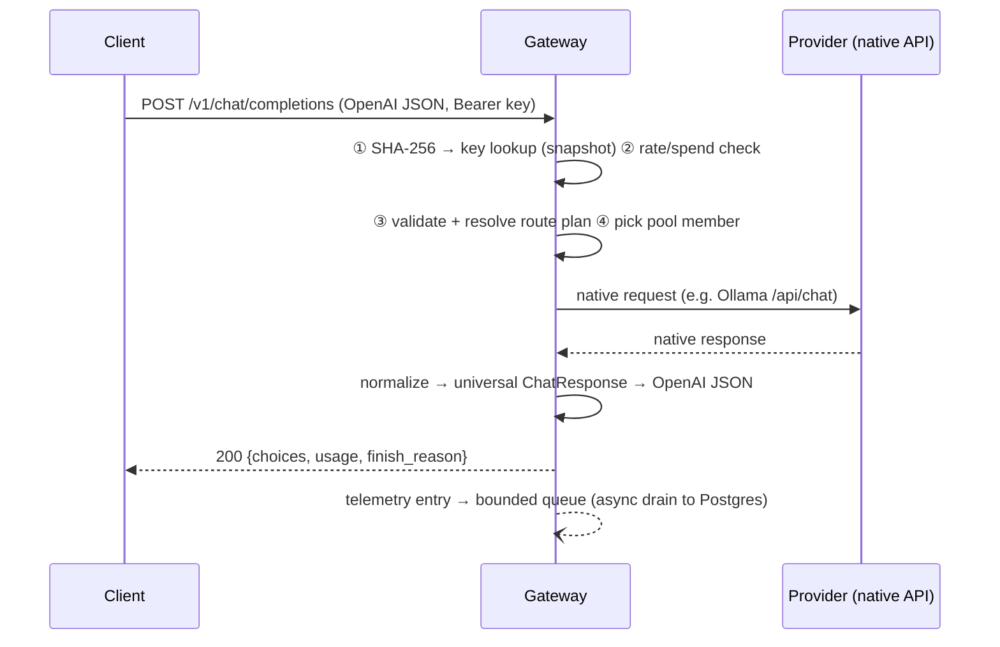
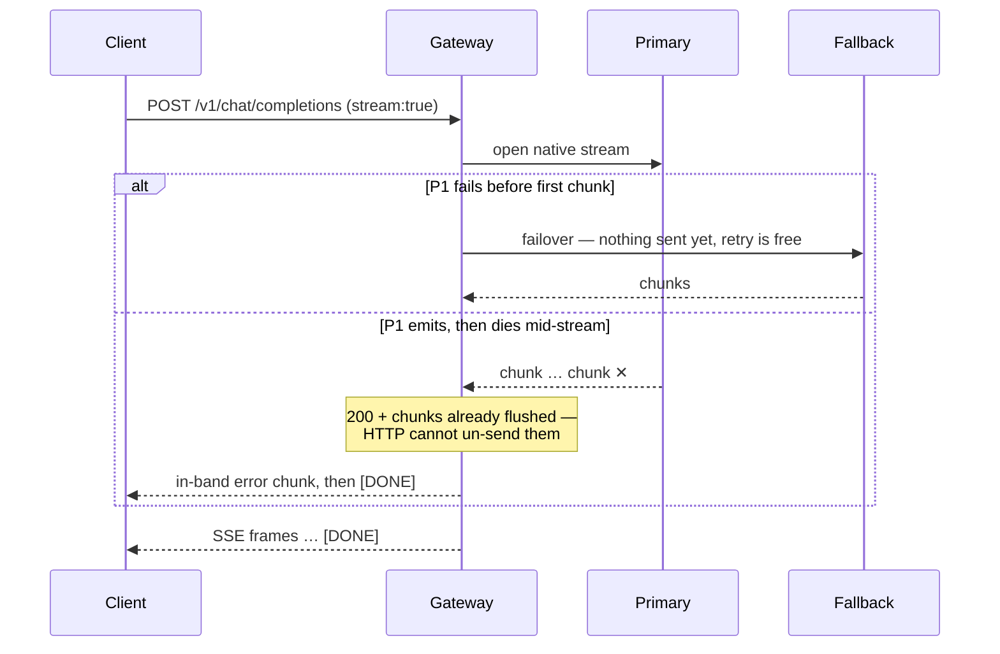

# BotvinnikAPI — High-Level Design

| | |
|---|---|
| **System** | BotvinnikAPI — a self-hosted LLM gateway |
| **Status** | Implemented; all subsystems described here are built and tested (93 tests) |
| **Stack** | Java 25 · Spring Boot 4.1 (WebFlux/Netty) · PostgreSQL (R2DBC + Flyway) · Resilience4j · Bucket4j |
| **Deployment shape** | Single-node, single-operator; localhost or trusted LAN |

---

## 1. Purpose

Applications increasingly speak one wire protocol to LLMs — OpenAI's — regardless of which model actually serves them. Meanwhile the models themselves fragment across local runtimes (Ollama on a LAN GPU box) and cloud APIs (Gemini), each with its own wire format, streaming encoding, credential scheme, and failure modes.

BotvinnikAPI is the translation and traffic-management layer between those two worlds:

- **Clients** (OpenAI SDK, LangChain, LlamaIndex, Cursor, Continue.dev, curl) connect to one endpoint with one API key and never learn which backend served them.
- **Operators** register providers, group them into load-balanced pools, define model aliases with fallback chains, mint client keys with rate/spend limits, and watch it all on a read-only dashboard.

One sentence: **it routes; it does not infer.**

## 2. Goals and non-goals

**Goals**

1. Full OpenAI wire compatibility on the data plane — streaming and non-streaming, tool calls, reasoning traces — so existing tools work unmodified.
2. Native adapters per provider family (Ollama NDJSON, Gemini SSE), normalized into one universal request/response/chunk model.
3. Deliberate failure semantics: failover that respects what has already been sent to the client.
4. Load balancing suited to LLM traffic, where a request may run 200 ms or 3 minutes.
5. Gateway overhead so small it disappears against inference latency (< 5 ms p99 budget; ~0.3 ms measured p50).
6. Operational hygiene: authentication, rate limits, spend caps, encrypted credentials, SSRF defense, request telemetry.

**Non-goals**

- Not a model-serving runtime, not multi-tenant SaaS (no orgs/RBAC), not a prompt-management or eval platform.
- No moderation engine — a 50–200 ms classifier does not belong in a path with a 5 ms overhead budget.
- No semantic caching.
- No horizontal scaling / HA in the current design: rate limits, spend counters, and circuit state are in-memory and single-node.

## 3. System context



Two personas, two planes:

| Plane | Endpoints | Consumer | Auth |
|---|---|---|---|
| **Data plane** | `POST /v1/chat/completions`, `GET /v1/models` | Applications | `Authorization: Bearer sk_live_…` |
| **Control plane** | `/v1/providers`, `/v1/pools`, `/v1/aliases`, `/v1/apikeys`, `/v1/health`, `/v1/logs`, `/v1/usage`, `/v1/stats`, `/dashboard` | Operator | None by design — must stay on localhost/trusted network |

## 4. Architecture overview

```mermaid
flowchart LR
    subgraph GW["Gateway process"]
        direction LR
        subgraph HOT["Data-plane hot path — zero synchronous DB calls"]
            AUTH["① Auth filter<br/>SHA-256 → snapshot map"]
            LIMIT["② Rate limit + spend cap<br/>Bucket4j / in-memory counters"]
            ROUTE["③ Route resolution<br/>alias → route plan"]
            LB["④ Pool balancer<br/>P2C · least-conn · RR"]
            CB["⑤ Circuit breakers<br/>Resilience4j + failover walk"]
            ADAPT["⑥ Provider adapters<br/>universal ⇄ native mapping"]
            AUTH --> LIMIT --> ROUTE --> LB --> CB --> ADAPT
        end
        SNAP[("Config snapshot<br/>AtomicReference, rebuilt on write")]
        SINK["Telemetry sink<br/>bounded queue 10K, drop-oldest,<br/>batched drain ~500 rows/s"]
        CTRL["Control-plane controllers<br/>providers · pools · aliases · apikeys"]
        DASH["Dashboard (static, read-only)"]
    end
    PG[("PostgreSQL<br/>Flyway-migrated schema,<br/>request_logs partitioned by ts")]

    SNAP -.reads.-> AUTH
    SNAP -.reads.-> ROUTE
    ADAPT -.per-attempt telemetry.-> SINK
    SINK --> PG
    CTRL --> PG
    CTRL -->|"rebuild()"| SNAP
    DASH -.polls REST.-> CTRL
```



### 4.1 The load-bearing rule

**The data plane makes zero synchronous database calls.** All routing/auth state lives in an immutable in-memory snapshot (`ProviderRegistry` + API-key map behind an `AtomicReference`). Every control-plane write finishes by rebuilding the snapshot from Postgres and atomically swapping the reference. A request therefore costs: one SHA-256, a few map lookups, one JSON transform each way. The database exists for the operator and the audit trail, never for the request.

### 4.2 Components

| Component | Responsibility |
|---|---|
| **Auth filter** | Hashes the bearer token (SHA-256), looks it up in the snapshot; miss → `401`. Checks the key's spend cap against the in-memory spend tracker. Stamps request context for telemetry. `last_used_at` is updated asynchronously, at most once/minute per key. |
| **Rate-limit filter** | Bucket4j token bucket per key (`rate_limit_rpm`); exhausted → `429` + `Retry-After` before any routing work. |
| **Route resolution** | `model` string → route plan. An **alias** yields its primary plus each fallback as ordered attempts. `provider/model` pins to that exact instance. Any attempt whose provider belongs to a **pool** widens to all pool members. |
| **Pool balancer** | Picks one member per attempt: P2C (default — two random candidates, less-loaded wins), least-connections, or round-robin. Keys off live in-flight depth; members with an open circuit are excluded; DEGRADED members are deprioritized. |
| **Request router** | Walks attempts at connect time with circuit breakers wrapped around every provider call; enforces the streaming point of no return; wraps an exhausted multi-attempt chain in `503 provider_unavailable`. |
| **Provider adapters** | One class per provider family implementing a common interface (`chat`, `stream`, `listModels`, `healthCheck`). Map the universal request/response/chunk model to native wire formats. Adding a provider touches exactly one factory case + one adapter class. |
| **Config snapshot service** | Rebuilds the registry (providers, aliases, pools, API keys) from Postgres; decrypts provider credentials into memory; atomic swap. |
| **Telemetry sink** | Bounded ArrayBlockingQueue (10 000, drop-oldest) drained on a self-pacing loop into `request_logs` (≈500 rows/s). Computes per-request USD cost from a configurable price book and feeds the in-memory spend tracker synchronously — enforcement never waits for the DB. |
| **Dashboard** | Single static HTML page polling the REST surface every 4 s. Read-only by design. |

## 5. Request lifecycle

### 5.1 Non-streaming



On a connect-class failure (unreachable, 5xx, 429, open circuit) the router moves to the next attempt in the plan. If all attempts fail this way, the client gets a structured `503`; a single pinned provider's original error passes through unchanged.

### 5.2 Streaming and the point of no return



The boundary is explicit: **failover is legal only until the first chunk is flushed.** After that, errors travel in-band as a structured error frame followed by `[DONE]`, and the request is logged as `partial`. Two further contracts:

- **Idle timeout, not total timeout** — the timeout sits on the gap *between* chunks (per-provider configurable, default 60 s). A 3-minute generation is legitimate; silence is the pathology.
- **Cancellation propagates** — client disconnect cancels the reactive chain and closes the upstream connection, stopping token spend. Verified by tests that latch on upstream connection disposal.

## 6. Routing model

```
"assistant"                 alias    → primary local-ollama/qwen3:1.7b
                                       fallbacks [google/gemini-2.5-flash]
"local-ollama/qwen3:1.7b"   pinned   → exactly that provider (no pool widening)
"qwen3:1.7b"                bare     → first provider that serves it
```

- **Aliases** are the operational unit: retargeting one via `PATCH` migrates every client instantly, with zero client changes.
- **Pools** group interchangeable providers; alias/bare routes widen to the pool, pinned routes do not ("if you name the box, you get the box").
- **Health is not boolean.** Each provider carries a dual-rate EWMA of TTFT (fast α=0.3, slow α=0.05). Fast > 2× slow ⇒ `DEGRADED` (deprioritized but eligible). Circuit open ⇒ `OPEN` (skipped, probed via half-open). Unreachable ⇒ `DOWN`.
- **Why not round-robin:** LLM request cost varies ~1000× with output length, so request count is a meaningless load signal; live in-flight depth is used instead, and P2C avoids herd behavior on "least loaded".

## 7. Failure semantics (the contract)

| Failure | Policy |
|---|---|
| Unreachable at connect | Circuit records it → failover down the chain → `503` if exhausted |
| Dies mid-stream | In-band error chunk + `[DONE]`; logged `partial`; **no failover** |
| Client disconnects | Cancellation propagates; upstream closed |
| Hangs between chunks | `504 stream_idle_timeout` (failover-eligible pre-first-chunk) |
| Upstream `429`/`5xx` | Failure for the breaker; failover-eligible |
| Malformed chunk | Log, skip, continue the stream |
| Model refusal / safety filter | `200 OK`, passed through verbatim — **not a failure**, breaker untouched |
| Rate limit / spend cap | `429` at ingress with `Retry-After`, before routing |
| Circuit open, no fallback | Structured `503`, never a stack trace |

The circuit breaker's failure predicate is deliberately narrow — only availability-class errors count (unreachable, idle timeout, 5xx, 429, transport faults). Validation errors and refusals never trip it, because a breaker that counts "the model said no" burns healthy backends.

## 8. Data model

```
providers      id, name, type, base_url, encrypted_api_key, nonce,
               stream_idle_timeout_ms, pool_id → pools, status, created_at
pools          id, name, strategy ('p2c' | 'least_conn' | 'round_robin')
aliases        id, alias, target_provider_id → providers, target_model,
               fallback_chain JSONB (ordered)
api_keys       id, key_hash (SHA-256, unique), name, rate_limit_rpm,
               spend_cap_usd, max_tokens_cap, log_content, created_at, last_used_at
request_logs   id, api_key_id, provider_id, model, ts, latency_ms, ttft_ms,
               prompt_tokens, completion_tokens, outcome, error_code, cost_usd,
               prompt_excerpt, response_excerpt        -- PARTITIONED BY RANGE (ts)
```

Managed by Flyway (V1 control plane, V2 auth/hardening). `request_logs` is range-partitioned on `ts` with a default partition so inserts never fail; content excerpts are only stored for keys with `log_content = true`, bounded to 2 KB.

## 9. Security design

| Concern | Design |
|---|---|
| **Gateway API keys** | 32 bytes of CSPRNG entropy (`sk_live_…`), shown exactly once; only the SHA-256 stored. Fast hashing is deliberate — with 256-bit random input there is nothing for bcrypt/argon2 slowness to protect. |
| **Provider credentials** | AES-GCM-256 at rest, fresh 12-byte nonce per record (GCM nonce reuse leaks the auth key). Key from `GATEWAY_ENCRYPTION_KEY`; legacy plaintext rows are auto-encrypted at boot. Never serialized back out of the API. |
| **SSRF** | Operators register arbitrary URLs, so defense is at **connection time**: a custom Netty resolver validates every resolved IP at the moment of connect — immune to DNS rebinding, which defeats parse-time checks. Blocklist: RFC1918, loopback, link-local/cloud-metadata (169.254.0.0/16), CGNAT, ULA/IPv6 link-local, IPv4-mapped IPv6. RFC1918/loopback are allowlisted by config because routing to LAN GPUs is the product. Redirects disabled. Registration also validates early for a friendly `400`. |
| **Resource limits** | Request body cap (2 MB), prompt-size cap at ingress, per-key `max_tokens_cap` clamped into upstream requests, per-key rate limit and spend cap. |
| **Trust boundary** | The control plane is intentionally unauthenticated and must not be exposed beyond localhost/trusted LAN. This is the documented single-operator scope, and the first thing to change if the scope ever grows. |

## 10. Performance

**Budget:** the gateway is never the bottleneck; inference is. Target < 5 ms p99 added overhead, O(chunk) streaming memory, no accumulation.

**Measured** (full auth on, near-zero-latency stub provider isolating the gateway, dev laptop sharing CPU with the load generator):

| Concurrency | Throughput | p50 | p95 | p99 | Errors |
|---|---|---|---|---|---|
| 10 | 6,700 req/s | 1.3 ms | 2.8 ms | 4.1 ms | 0 |
| 50 | 9,700 req/s | 4.2 ms | 10.8 ms | 18.8 ms | 0 |
| 200 | ~10,500 req/s (saturation) | 14.6 ms | 43.2 ms | 99.4 ms | 0 |

Added latency over a direct call at p50: **~0.3 ms**. Against a 200–3,000 ms LLM call, the gateway disappears.

Three self-inflicted ways a proxy like this dies, and the countermeasure for each:

1. **Sync DB call on the hot path** → the config snapshot (see 4.1).
2. **Buffering responses for logging** → chunks pass through; content logging keeps only a bounded 2 KB excerpt.
3. **Unbounded telemetry queue** → bounded 10 K queue, drop-oldest, self-pacing batched drain (a slow DB degrades logging, never requests). The drain deliberately avoids `Flux.interval` + `concatMap`, which dies permanently by overflow when a batch outlasts the tick — found under load test, fixed with a drain→delay→repeat loop.

Backpressure in the streaming path is TCP flow control (client stalls → Netty stops reading upstream → provider stalls); Reactor backpressure operators earn their keep only at the telemetry queue, the one real in-memory buffer.

## 11. Technology choices

| Choice | Rationale |
|---|---|
| **Spring WebFlux (Netty)** | A streaming proxy is the natural reactive workload; WebClient yields a `Flux` whose cancellation propagates natively. Whole-app decision — nothing may block. |
| **R2DBC** | Consequence of WebFlux, not a performance claim: JDBC blocks, and WebFlux runs ~one thread per core. The performance win is the snapshot removing the DB from the hot path, not the driver. |
| **Flyway (JDBC)** | Runs at startup before traffic, where blocking is irrelevant. Both a JDBC connection (migrations) and an R2DBC pool (runtime) exist; that is normal. |
| **Resilience4j** | Per-provider circuit breakers (count-based window 10, min 4 calls, 50% threshold, 15 s open → half-open probe) with a custom failure predicate. |
| **Bucket4j** | Token-bucket rate limiting in a WebFilter, per key. |
| **PostgreSQL** | Relational control plane + partitioned telemetry. ClickHouse becomes interesting only past millions of rows/day; below that a second database is operational cost with no benefit. |

## 12. Operations

- **Config:** env vars — `DB_*` (Postgres), `GEMINI_API_KEY` (required at boot), `GATEWAY_ENCRYPTION_KEY` (32-byte base64; dev fallback logs a loud warning), `AUTH_ENABLED`. Providers can be seeded from `application.yaml` (insert-if-absent) or registered at runtime.
- **Observability:** `/v1/health` (status, circuit, in-flight, TTFT fast/baseline, ping), `/v1/stats` (req/min, error rate, TTFT p50/p95/p99 over a window), `/v1/logs` (filterable history), `/v1/usage` (spend per key/provider/model), and the `/dashboard` page over all of it.
- **Testing:** 93 tests biased toward fault injection — WireMock providers returning 5xx/garbage, raw Netty servers that die mid-body or hang, cancellation latches on connection disposal, breaker trip counts asserted at the wire level, control-plane contract tests against real Postgres (Testcontainers), SSRF/crypto unit suites, and an auth/rate-limit/spend-cap integration suite.

## 13. Known limitations and future work

- **Single node.** Rate limits, spend counters, circuit state, and TTFT stats are in-memory: not shared across replicas, reset on restart (spend reseeds from `request_logs`). HA requires externalizing this state.
- **Control plane is open.** Correct for the localhost scope; operator auth is the first requirement if that scope grows.
- **Provider coverage.** Ollama + Gemini today. An OpenAI-compatible adapter is the highest-leverage addition (unlocks OpenAI, Groq, OpenRouter, vLLM, Together in one class).
- **Packaging.** No Dockerfile/compose yet; quickstart requires JDK 25 + a Postgres container.
- **Interceptor seam.** A request/response interceptor chain (no-op default) is the designed extension point for guardrails; intentionally not a moderation engine.
- Prompt limits count characters, not tokens; daily partition rotation for `request_logs` is not yet automated; no Prometheus/OTel export.
